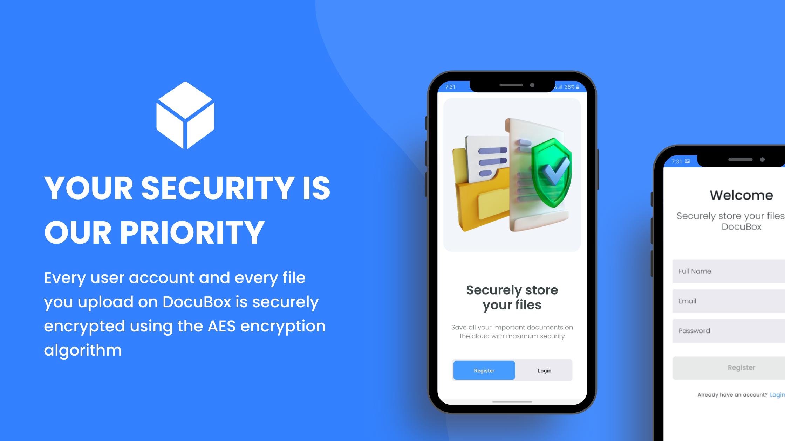
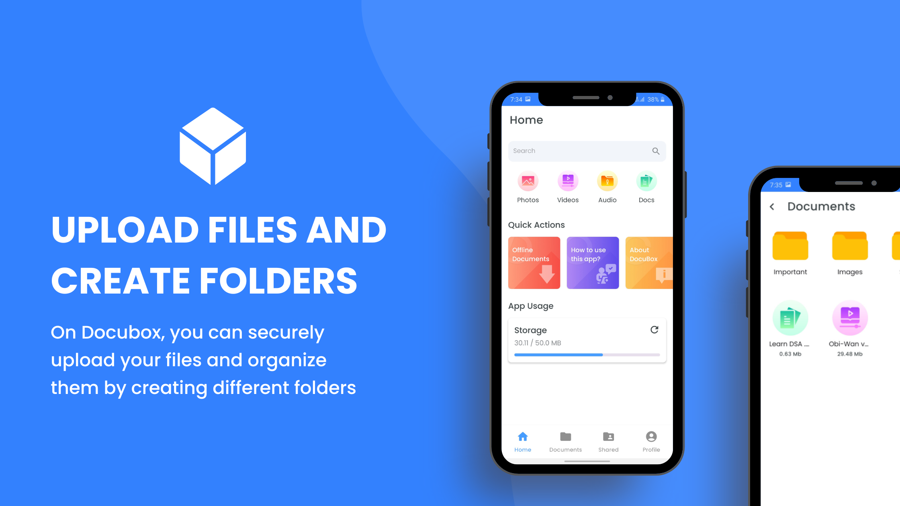
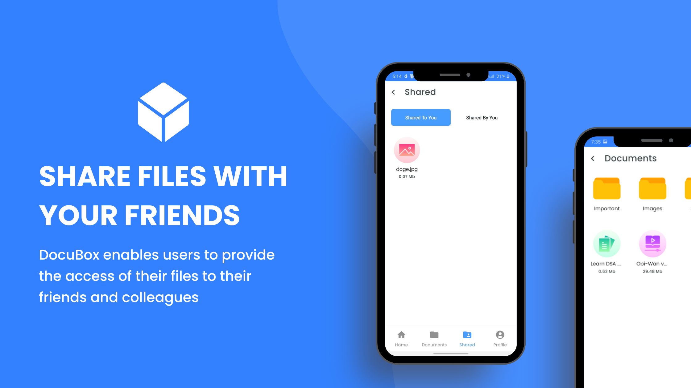

# How to Use DocuBox

## Authentication Screens

- You can either login if you have an account or create a new one.
- DocuBox currently supports only Email based authentication with support of Google Login to be added in future.

 

## Home Screen
- You can click on the Search Bar and search for files.
- Clicking any of the items like Video, Images and rest will show you all the videos, images etc you have stored in DocuBox.
- Quick Actions redirect you to the downloads folder where you downloaded files are stored and redirect you to important app pages.

## Documents Screen
- You can click on any folder to navigate inside that folder.
- You can click on any file to view it. Files supported for viewing currently are images, videos and audio.
- You can click on the bottom + button to either create a new folder or upload a file.
- You can long press on any folder to rename or delete it.
- You can long press on any file to rename, give view access to other user, revoke access or delete the file.

 

## Share Screen
- You can see all the files that have been shared with you. 
- You can also see all the files which you have shared with someone else.

