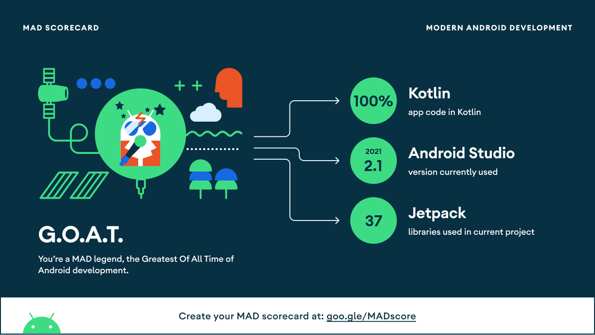

# **DocuBox** 

**DocuBox** is an cloud storage app in which we can securely save our files.

<!-- # Blog ✍ -->

<!-- To know more about how I build this project, read my article on https://vaibhav2002.hashnode.dev/DocuBox-an-app-to-track-your-daily-water-intake-and-sleep-and-boost-your-work-efficiency-auth0hackathon -->

# Application Install

***You can Install and test latest DocuBox app from below 👇***

[](https://github.com/Vaibhav2002/DocuBox-AndroidApp/releases/tag/v1.0.0)

## Setup
- Clone the repository on your machine.
- Clone the [backend code](https://github.com/ishantchauhan710/DocuBox) and set it up by following its README.
- After setting up the backend, do the following:

Open Secrets.kt in util package and add your backend Base URL

```kotlin
//Add your base url here
const val BASE_URL = "http://[your server url]/api/"
```

## About

It uses a custom NodeJS Server running on Linode. It uses Linode for database and storage hosting.

- Fully functionable. 
- Clean and Simple Material UI.
- Best and Clean Code Quality following Modern Android Development, SOLID Principles and much more.

### App Features

- **User Authentication** - Supports email based authentication
- **Saving Files** - You can upload your files to DocuBox's cloud storage and access it anywhere.
- **File Encryption** - Files stored on DocuBox is secure and encrypted, so your data is securely stored.
- **Sharing File Access** - You can share view access of your files to other users.
- **File Management** - You can create multiple folders to organize your storage just as you want it.
- **File Download** - You can even download your files and save them locally for offline access.
- **Enhanced File Search** - Super fast file searching which can search files instantly.

### Insights into the app 🔎

<!-- Place all mockups and banners here -->

## 📸 Screenshots 

|   |   |   |
|---|---|---|
||  | 
| |  | 
|| | 
| |  | 

### Technical details 

- DocuBox uses custom NodeJS Server running on Linode as its backend.
- DocuBox uses Retrofit to make all REST API calls to the NodeJS backend.
- DocuBox is made using Kotlin and following Modern Android Development practices.
- DocuBox uses Kotlin Coroutines and Flow to handle all asynchronous tasks.
- DocuBox uses all Jetpack libraries and follows MVVM architecture. It also has a G.O.A.T rating in Android's  M.A.D scorecard.
- DocuBox's code follows all the best practices and software development principles like SOLID which make it a very good learning resource for beginners as well as for people looking to improve thier software design skills.
- DocuBox's code is properly linted using Ktlint.




## Built With 🛠
- [Kotlin](https://kotlinlang.org/) - First class and official programming language for Android development.
- [Coroutines](https://kotlinlang.org/docs/reference/coroutines-overview.html) - For asynchronous and more..
- [Flow](https://kotlin.github.io/kotlinx.coroutines/kotlinx-coroutines-core/kotlinx.coroutines.flow/-flow/) - A cold asynchronous data stream that sequentially emits values and completes normally or with an exception.
 - [StateFlow](https://developer.android.com/kotlin/flow/stateflow-and-sharedflow) - StateFlow is a state-holder observable flow that emits the current and new state updates to its collectors.
 - [SharedFlow](https://developer.android.com/kotlin/flow/stateflow-and-sharedflow) - A SharedFlow is a highly-configurable generalization of StateFlow.
- [Android Architecture Components](https://developer.android.com/topic/libraries/architecture) - Collection of libraries that help you design robust, testable, and maintainable apps.
  - [ViewModel](https://developer.android.com/topic/libraries/architecture/viewmodel) - Stores UI-related data that isn't destroyed on UI changes. 
  - [ViewBinding](https://developer.android.com/topic/libraries/view-binding) - Generates a binding class for each XML layout file present in that module and allows you to more easily write code that interacts with views.
  - [DataBinding](https://developer.android.com/topic/libraries/data-binding) - Binds data directly into XML layouts
  - [Room](https://developer.android.com/training/data-storage/room) - Room is an android library which is an ORM which wraps android's native SQLite database
  - [DataStore](https://developer.android.com/topic/libraries/architecture/datastore) - Jetpack DataStore is a data storage solution that allows you to store key-value pairs or typed objects with protocol buffers.
- [Dependency Injection](https://developer.android.com/training/dependency-injection) - 
  - [Hilt-Dagger](https://dagger.dev/hilt/) - Standard library to incorporate Dagger dependency injection into an Android application.
  - [Hilt-ViewModel](https://developer.android.com/training/dependency-injection/hilt-jetpack) - DI for injecting `ViewModel`.
- [GSON](https://github.com/google/gson) - A modern JSON library for Kotlin and Java.
- [Timber](https://github.com/JakeWharton/timber) - A simple logging library for android.
- [Retrofit](https://square.github.io/retrofit/) - A type-safe HTTP client for Android and Java.
- [GSON Converter](https://github.com/square/retrofit/tree/master/retrofit-converters/gson) - A Converter which uses Moshi for serialization to and from JSON.
- [Coil](https://github.com/coil-kt/coil) - An image loading library for Android backed by Kotlin Coroutines.
- [Material Components for Android](https://github.com/material-components/material-components-android) - Modular and customizable Material Design UI components for Android.

# Package Structure
    
    com.docubox             # Root Package
    .
    ├── data                # For data handling.
    |   ├── local           # Local Datasource and classes
    |   ├── remote          # Remote datasources and API Service
    │   ├── model           # Model data classes and mapper classes, both remote and local entities
    │   └── repo            # Single source of data.
    |
    ├── service             # Foreground Service to upload File to server
    |
    ├── di                  # Dependency Injection             
    │   └── module          # DI Modules
    |
    ├── ui                  # UI/View layer
    |   ├── adapters        # Adapter, ViewHolder and DiffUtil
    |   └── screens         # All App Screens 
    |
    └── utils               # Utility Classes / Kotlin extensions


## Architecture
This app uses [***MVVM (Model View View-Model)***](https://developer.android.com/jetpack/docs/guide#recommended-app-arch) architecture.


  


---

## If you like my projects and want to support me to build more cool open source projects
  
<a href="https://www.buymeacoffee.com/VaibhavJaiswal"></a>

---

 ## Contact
If you need any help, you can connect with me.

Visit:- [Vaibhav Jaiswal](https://vaibhavjaiswal.vercel.app/#/)
  


